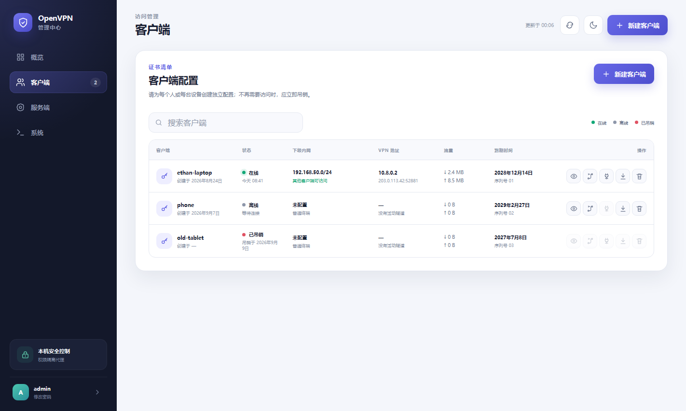
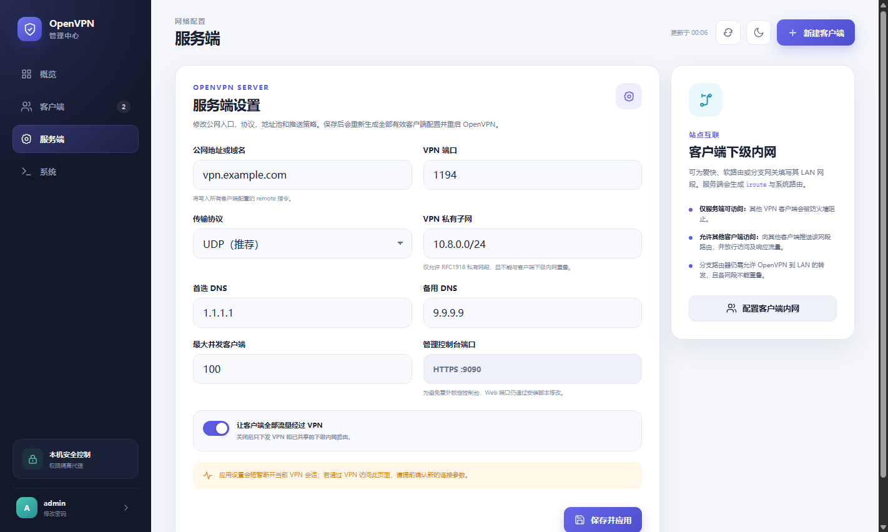
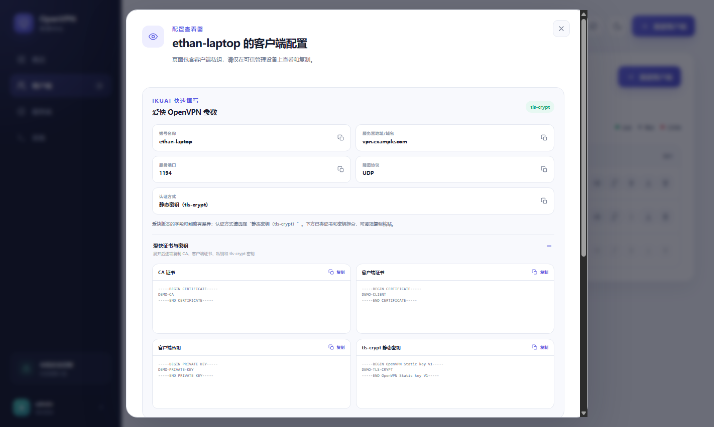

# OpenVPN 管理中心

一个轻量、现代、全中文的 OpenVPN Web 管理面板。执行一次安装脚本，即可完成 Easy-RSA PKI、
OpenVPN 服务端、路由转发、防火墙、HTTPS 反向代理、首个客户端和管理控制台初始化。


## 主要特性

- **一键安装**：支持 Debian 12/13、Ubuntu 22.04/24.04 及更新版本；首次或全新安装自动选择随机 VPN 端口。
- **安全升级/修复**：重复执行安装器时自动备份并保留 CA、客户端、密码和未显式覆盖的服务端参数，包括当前 VPN 端口。
- **服务端可视化配置**：在 Web 页面修改公网地址、端口、UDP/TCP、VPN 子网、DNS、全流量转发、最大连接数，以及 MTU、MSS、Keepalive、加密、日志、控制台来源和推送路由。
- **客户端全生命周期**：创建、查看、复制、下载、踢出在线连接和吊销 `.ovpn` 配置。
- **爱快 iKuai 友好**：点击客户端名称即可查看完整配置，并逐项复制 CA、客户端证书、私钥和 `tls-crypt` 密钥。
- **客户端下级内网**：为爱快、软路由或分支网关配置 LAN CIDR，可选择仅服务端访问或允许其他 VPN 客户端访问。
- **一键在线更新**：从本项目 GitHub 最新稳定 Release 更新面板，并通过系统软件源升级 OpenVPN。
- **全中文现代界面**：响应式布局、深浅色主题，无前端框架和 CDN 依赖。
- **轻量运行**：后端仅使用 Python 标准库。
- **权限隔离**：Web 服务以普通用户运行，PKI 和系统操作由受限 Unix 套接字后的 root 代理执行。

## 架构

```text
浏览器 --HTTPS--> nginx --HTTP/127.0.0.1--> Web 服务（openvpn-web）
                                                    |
                                                    | Unix 套接字 0660
                                                    v
                                             root 控制代理
                                                    |
                           Easy-RSA / systemd / OpenVPN / iptables
```

OpenVPN 还会创建仅 root 可连接的本地管理套接字，用于踢出指定客户端的当前在线会话。浏览器不会
直接连接任何特权进程。

## 环境要求

- 使用 systemd 的 Debian/Ubuntu 服务器；
- root 或 `sudo` 权限；
- 公网 IPv4 地址或指向服务器的域名；
- 放行安装器最终输出的随机 OpenVPN 端口和默认 TCP `8443` 管理端口，或放行自定义端口。

安装器使用 Debian/Ubuntu 的 `/etc/openvpn/server` 目录和
`openvpn-server@server.service` 服务单元。

## 一键安装

建议先查看脚本，再执行：

```bash
git clone https://github.com/laoluonb/openvpn-web-manager.git
cd openvpn-web-manager
sudo ./install.sh --endpoint vpn.example.com
```

服务器直接使用公网 IP 时可省略 `--endpoint`，安装器会自动探测公网 IPv4 地址。

### 安装参数

```text
--endpoint HOST          公网 IPv4 地址或域名
--vpn-port PORT          OpenVPN 端口，全新安装默认随机选择 10000-29999；可传 random
--vpn-protocol PROTO     OpenVPN 协议：udp 或 tcp，默认 udp
--vpn-subnet CIDR        VPN 私有子网，默认 10.8.0.0/24
--dns-servers LIST       推送的 DNS，逗号分隔，默认 1.1.1.1,9.9.9.9
--redirect-gateway MODE  是否让客户端全部流量经过 VPN：yes 或 no
--max-clients COUNT      最大并发客户端数，默认 100
--tun-mtu MTU            TUN MTU，默认 1500
--mssfix MTU             MSS Fix，0 表示关闭，默认 1450
--keepalive-ping SEC     Keepalive 检测间隔，默认 10
--keepalive-timeout SEC  Keepalive 超时，默认 120
--data-cipher CIPHER     首选数据加密：AES-256-GCM、AES-128-GCM 或 CHACHA20-POLY1305
--auth-digest DIGEST     HMAC 摘要：SHA256、SHA384 或 SHA512，默认 SHA256
--log-verb LEVEL         OpenVPN 日志等级 0-11，默认 3
--push-routes LIST       推送给客户端的私有 CIDR，逗号或空格分隔
--web-port PORT          HTTPS 管理端口，默认 8443
--web-allow CIDR         允许访问控制台的来源，默认 0.0.0.0/0
--admin-user USER        控制台用户名，默认 admin
--admin-password PASS    控制台密码；省略时自动生成
--initial-client NAME    首个客户端名称，默认 admin
--tls-cert PATH          已有 PEM 证书，需与 --tls-key 同时使用
--tls-key PATH           已有 PEM 私钥，需与 --tls-cert 同时使用
--existing-action MODE   已有 OpenVPN 的处理方式：preserve、remove 或 abort
```

示例：使用 TCP 443、关闭全流量转发，并仅允许办公网段访问控制台：

```bash
sudo ./install.sh \
  --endpoint vpn.example.com \
  --vpn-port 443 \
  --vpn-protocol tcp \
  --redirect-gateway no \
  --web-allow 203.0.113.0/24 \
  --initial-client branch-office
```

### 已有 OpenVPN 的处理

- **本项目已有安装**：自动选择 `preserve`，备份后保留 CA、客户端证书、控制台账号、TLS 文件、
  客户端内网策略以及当前服务端参数，再执行升级或修复，包括现有 VPN 端口。
- **其他来源的 OpenVPN 配置**：交互终端会询问备份替换、彻底删除或退出；非交互环境默认先备份再替换。
- **仅安装软件包但没有配置**：复用软件包并继续初始化。

```bash
# 保留本项目当前参数并升级/修复，包括现有 VPN 端口
sudo ./install.sh --existing-action preserve

# 在保留其他参数的同时修改 VPN 端口
sudo ./install.sh --existing-action preserve --vpn-port 443 --vpn-protocol tcp

# 删除原配置后全新安装（不可恢复）
sudo ./install.sh --existing-action remove --endpoint vpn.example.com

# 检测到已有 OpenVPN 时退出
sudo ./install.sh --existing-action abort
```

`preserve` 备份位于 `/var/backups/openvpn-web-manager/时间戳/`，包含 OpenVPN 配置、PKI、状态目录
和相关 systemd 自定义单元。

首次安装、`remove` 全新安装或显式传入 `--vpn-port random` 时，安装器会在 `10000-29999` 中
选择可用的随机 OpenVPN 端口。普通升级、修复和 Web 一键更新会保留当前端口，避免现有客户端配置
失效。只有主动更换端口时，才需要放行新端口并重新下载客户端配置。

## Web 管理功能

访问 `https://服务器地址:8443`。未提供受信任证书时，首次访问需要确认自签名证书警告。



### 修改 OpenVPN 服务端

进入“服务端”页面，可修改：

- 公网地址或域名；
- VPN 端口与 UDP/TCP；
- VPN 私有地址池；
- 推送给客户端的 DNS；
- 是否将客户端全部流量转发到 VPN；
- 最大并发客户端数；
- 控制台允许来源（IPv4 CIDR）；
- 高级网络参数：TUN MTU、MSS Fix、Keepalive 检测间隔/超时、首选数据加密、HMAC 摘要和日志等级；
- 自定义私有推送路由，每行一个 CIDR。

首次使用建议保持默认值：TUN MTU `1500`、MSS Fix `1450`、Keepalive `10/120`、
AES-256-GCM、SHA256 和日志等级 `3`。自定义推送路由只适用于需要让所有客户端访问的公共私网；
爱快等分支客户端自己的 LAN，应在客户端行的“配置下级内网”中填写，并按需打开“允许其他 VPN 客户端访问”。

保存后会验证网段冲突、重新生成 `server.conf` 和全部有效客户端配置、同步防火墙，并重启
OpenVPN。VPN 子网变化时会清理旧地址池记录，避免客户端继续取得旧网段地址。



### 查看配置与爱快 iKuai

在“客户端”页面点击客户端名称或“查看”图标，即可打开配置查看器：

1. 显示拨号名称、服务器地址、端口、线路、UDP/TCP、TUN、加密算法、LZO、MTU 和认证方式；
2. 显示完整 `.ovpn` 内容，可一键复制或下载；
3. 显示附加配置、服务器路由推送、添加路由、定时重拨和线路检测建议，可一键复制完整填写清单；
4. 单独显示 CA 证书、客户端证书、客户端私钥和 `tls-crypt` 静态密钥，可逐项复制。

在爱快添加 OpenVPN 时，按配置查看器中的“爱快填写顺序”操作：线路选“自动”、隧道类型选 `TUN`、
LZO 压缩关闭、MTU 使用页面值，认证方式选择 **静态密钥（tls-crypt）**，然后分别复制 CA、客户端证书、
客户端私钥和 `tls-crypt` 静态密钥。服务器路由推送通常启用，添加路由通常留空；只有爱快版本不接受推送时，
才把页面给出的 CIDR 一行一条手动填写。不同爱快版本的字段名称可能略有差异。配置页面包含客户端私钥，
只应在可信管理设备上打开。



### 踢出与吊销

- **踢出连接**：立即断开该客户端当前在线会话，不删除证书；客户端仍可使用原配置重新连接。
- **吊销并删除**：撤销证书、更新 CRL，并删除该客户端的 `.ovpn`、证书、私钥、证书请求及 Easy-RSA 序列号归档文件；原配置将永久失效，同名证书不能直接重新创建。
- 为保证旧证书不会重新生效，Easy-RSA 的 `pki/index.txt` 吊销记录和 CRL 文件不会删除；它们是吊销校验所必需的审计数据。
- 客户端列表、概览数量和日志入口只显示有效证书；已吊销或已过期记录不会再显示。

### 客户端下级内网

创建客户端或编辑已有客户端时，可填写该设备后方的 LAN，例如 `192.168.50.0/24`，并选择：

- **仅服务端可访问**：服务端生成 `route` 和该客户端的 `iroute`；不向其他客户端下发路由，
  防火墙同时阻止其他 VPN 客户端手工添加路由后访问。
- **允许其他 VPN 客户端访问**：只向其余有效客户端下发该 LAN 路由，不会把路由推回 LAN 所属
  客户端；防火墙允许其他客户端的访问流量和对应响应流量。

部署前请确认：

- VPN 子网和所有分支 LAN 均为 RFC1918 IPv4 私有网段，且彼此不能重叠；
- 下级内网所属客户端当前在线；离线客户端后方的 LAN 必然不可达；
- 爱快或分支路由器已允许 OpenVPN 隧道到 LAN 的转发；
- LAN 主机的返回流量经过该爱快或分支路由器；
- 上游安全组已放行实际使用的 OpenVPN 端口。

OpenWrt 日志中若能看到 `Initialization Sequence Completed`，且可以访问路由器的 `10.8.0.x` 地址，
但仍不能访问它后方的 LAN，通常需要把 OpenVPN 对应接口（例如 `vpn0`/`tun0`）加入防火墙区域，
并允许该区域转发到 `lan`。若 OpenWrt 不是 LAN 设备的默认网关，还需在实际网关添加返回 VPN 子网
的静态路由，或在 OpenWrt 上对 VPN 到 LAN 的流量做源 NAT。

## 一键在线更新

进入“系统”页面，先点击“检查更新”或等待页面自动检查，再点击“更新面板与 OpenVPN”。系统会显示当前版本、远程最新版本、OpenVPN 软件源候选版本、Release 日期和更新日志；发现新版本时会弹出中文提醒框。

更新任务会：

1. 读取 `laoluonb/openvpn-web-manager` 最新稳定 Release；
2. 下载并安全检查 GitHub 自动生成的源码包；
3. 备份现有 OpenVPN、CA、客户端和管理配置；
4. 保留当前 VPN 端口及其他服务端参数并运行最新版安装器；
5. 通过系统软件源安装可用的最新版 OpenVPN；
6. 在页面显示排队、运行、完成或失败状态。

版本检查不会修改 OpenVPN 配置。管理面板远程版本来自 GitHub 最新稳定 Release；OpenVPN 候选版本来自服务器当前 APT 软件源。网络暂时不可用时，页面会保留上次成功检查结果，不影响正在运行的 VPN。

更新不会更换 VPN 端口，也不需要重新下载客户端配置。更新期间管理页面和 VPN 连接可能短暂中断。
失败时可查看：

```bash
journalctl -u openvpn-manager-update.service -n 200 --no-pager
```

## 命令行管理

安装完成后执行 `sudo openvpn-manager`，即可进入类似图片所示的中文数字菜单；
菜单支持 OpenVPN、管理面板、客户端、日志、远程版本检查和在线更新等常用操作。
也可以直接使用数字快捷命令，例如 `sudo openvpn-manager 1`。本机 CLI 与 Web
控制台使用同一个权限隔离代理：

```text
============================================================================
                         OpenVPN 管理中心命令行
============================================================================
(1) 重启管理面板                         (2) 停止管理面板
(3) 启动管理面板                         (4) 重载管理面板
(5) 重启 OpenVPN 服务                    (6) 停止 OpenVPN 服务
(7) 启动 OpenVPN 服务                    (8) 应用配置并重启
(9) 查看 OpenVPN 状态                    (10) 查看管理面板状态
(11) 查看客户端列表                       (12) 新建客户端
(13) 查看客户端配置                       (14) 设置客户端下级内网
(15) 踢出当前客户端                       (16) 吊销并删除客户端
(17) 查看服务端设置                       (18) 修改服务端设置
(19) 查看 OpenVPN 日志                    (20) 查看客户端日志
(21) 检查远程更新                         (22) 更新面板与 OpenVPN
(23) 查看更新任务状态
(0) 退出
============================================================================
```

数字菜单中的“更新面板与 OpenVPN”会沿用现有的 VPN 端口和服务端参数，不会因升级
重新随机端口。停止管理面板只停止本项目 Web 服务，不会停止 Nginx；“应用配置并重启”
会重新生成受管配置并重启 OpenVPN，请勿在唯一的 VPN 管理通道上盲目执行。
管理控制台端口属于安装级参数，命令行菜单只读显示；如需更换，请使用安装器的
`--web-port` 参数并提前放行新端口。

```bash
# 打开图片样式的交互菜单
sudo openvpn-manager
sudo openvpn-manager menu

# 数字快捷命令：1 = 重启管理面板，5 = 重启 OpenVPN，21 = 检查远程更新
sudo openvpn-manager 1
sudo openvpn-manager 5
sudo openvpn-manager 21

# 非交互命令
sudo openvpn-manager status
sudo openvpn-manager list

# 普通客户端
sudo openvpn-manager create alice-phone

# 分支客户端：仅服务端可访问其 LAN
sudo openvpn-manager create branch-a --lan-subnet 192.168.50.0/24

sudo openvpn-manager network branch-a 192.168.50.0/24 --share-lan

# 移除下级内网设置
sudo openvpn-manager network branch-a ""

sudo openvpn-manager disconnect branch-a
sudo openvpn-manager profile branch-a
sudo openvpn-manager revoke branch-a
# 吊销并删除该客户端的生成文件；PKI 吊销记录仍保留
sudo openvpn-manager logs 100
sudo openvpn-manager edit-settings
sudo openvpn-manager panel-status
sudo openvpn-manager restart
sudo openvpn-manager update
sudo openvpn-manager update-status
```

`profile` 输出包含私钥，请勿将结果写入不受保护的日志。生成的客户端文件位于
`/var/lib/openvpn-manager/clients/`，默认仅 root 和服务组可读。

## 关键文件

```text
/etc/openvpn/server/server.conf                 OpenVPN 服务端配置
/etc/openvpn/server/ccd/                        客户端 iroute 与定向推送路由
/etc/openvpn/server/easy-rsa/pki/               CA、证书、私钥与 CRL
/etc/openvpn-manager/server.json                管理面板服务端参数
/etc/openvpn-manager/client-networks.json       客户端下级内网策略
/etc/openvpn-manager/tls/                       管理控制台 HTTPS 证书
/var/lib/openvpn-manager/clients/               生成的 .ovpn 文件
/var/lib/openvpn-manager/update-status.json     在线更新状态
/var/lib/openvpn-manager/update-check.json      最近一次版本检查结果
/root/openvpn-manager-credentials.txt           首次生成的控制台凭据
```

## 备份、恢复与卸载

建议离线备份：

```text
/etc/openvpn/server/easy-rsa/pki
/etc/openvpn/server/tls-crypt.key
/etc/openvpn-manager
/var/lib/openvpn-manager/clients
```

仅移除服务并保留 PKI、配置和客户端文件：

```bash
sudo ./uninstall.sh --yes
```

永久删除受管数据：

```bash
sudo ./uninstall.sh --purge --yes
```

`--purge` 不可恢复。如果 CA 私钥可能泄漏，应轮换或退役整个 CA，而不是只删除服务器文件。

## 本地预览与测试

无需安装 OpenVPN 即可预览：

```bash
python3 backend/server.py --demo
```

访问 `http://127.0.0.1:9090`，账号为 `admin` / `demo`。演示模式仅监听本机回环地址，样例数据
保存在内存中。

```bash
make test
```

测试覆盖输入校验、密码与会话、Easy-RSA 索引、OpenVPN 状态、配置渲染、客户端路由、前端 DOM
引用、JavaScript 语法、Bash 语法和 ShellCheck。

## 旧版本安装中断恢复

如果旧版本停在 conntrack `sysctl` 参数错误处，拉取最新版并重新执行即可。安装器只加载自身的
IPv4 转发配置，不再加载主机上的其他第三方 sysctl 文件：

```bash
git pull --ff-only
sudo ./install.sh --existing-action preserve
```

如果 v1.1.1 在“正在配置 HTTPS”后报告缺少
`/etc/openvpn-manager/tls/server.crt`，最新版会备份并迁移
`/etc/openvpn-web-manager` 与 `/var/lib/openvpn-web-manager` 中的认证、TLS 和客户端状态，然后继续安装。

## 安全边界

- 当前提供一个本地管理员账号；需要多用户或 MFA 时，建议接入 SSO 或仅在私有管理网络开放。
- 自签名证书可以加密流量，但不能提供公网身份信任；生产环境建议安装受信任证书。
- 自动防火墙使用主机的 `iptables` 兼容层；复杂的 nftables、firewalld 或云防火墙策略需自行整合。
- Web 查看器会显示客户端私钥；管理员设备、浏览器扩展和剪贴板都应处于可信环境。
- 在线更新固定从本项目 GitHub Release 获取源码，但生产环境仍建议先在测试节点验证新版本。

## 许可证

MIT
