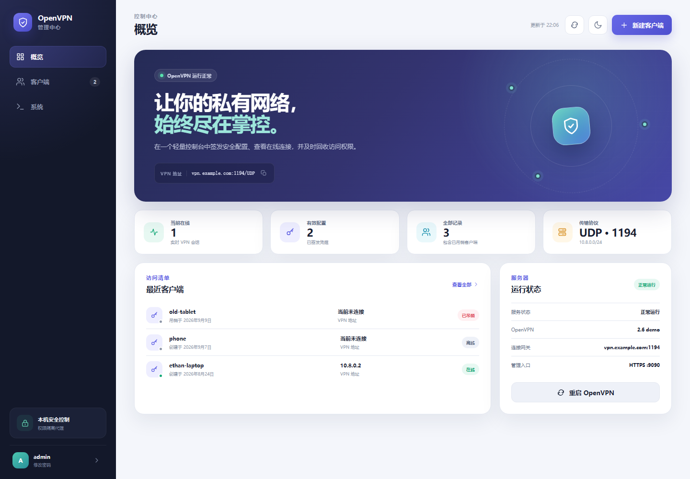

# OpenVPN 管理中心

一个轻量、现代、无第三方运行时依赖的 OpenVPN Web 控制台。执行一次安装脚本，即可完成
PKI、OpenVPN 服务、路由转发、防火墙、HTTPS 反向代理、首个客户端配置和中文管理界面的初始化。



## 主要特性

- **一键安装**：支持 Debian 12/13、Ubuntu 22.04/24.04 及更新版本
- **全中文现代界面**：响应式布局、深浅色主题，无前端框架和 CDN 依赖
- **轻量运行**：后端只使用 Python 标准库
- **权限隔离**：Web 服务以普通用户运行，PKI 操作由受限 Unix 套接字后的 root 代理完成
- **客户端全生命周期**：签发、下载、在线状态查看和吊销 `.ovpn` 配置
- **运行维护**：查看服务健康度、在线会话、最近日志，并可安全重启 OpenVPN
- **安全默认值**：TLS、`tls-crypt`、scrypt 密码哈希、安全 Cookie、CSRF 校验、登录限速、
  严格名称校验和 systemd 服务加固
- **可重复执行与回滚**：重新安装会保留 CA，并自动创建仅 root 可读的时间戳备份

## 架构

```text
浏览器 --HTTPS--> nginx --HTTP/本机回环--> Web 服务（openvpn-web）
                                              |
                                              | Unix 套接字，权限 0660
                                              v
                                       root 控制代理
                                              |
                                Easy-RSA / systemd / OpenVPN
```

浏览器不会直接连接特权进程。root 代理只接受少量固定 JSON 指令，并对每个客户端名称进行严格校验。

## 环境要求

- 使用 systemd 的 Debian/Ubuntu 服务器
- root 或 `sudo` 权限
- 指向服务器的公网 IPv4 地址或域名
- 放行 UDP `1194` 和 TCP `8443`（均可自定义）

安装器当前适配 Debian/Ubuntu 的软件包目录结构：
`/etc/openvpn/server` 与 `openvpn-server@server.service`。

## 安装

建议先查看脚本内容，然后执行：

```bash
git clone https://github.com/laoluonb/openvpn-web-manager.git
cd openvpn-web-manager
sudo ./install.sh --endpoint vpn.example.com
```

如果服务器直接使用公网 IP，可以省略 `--endpoint`，安装器会自动探测公网 IPv4 地址。

### 安装参数

```text
--endpoint HOST          公网 IPv4 地址或域名
--vpn-port PORT          OpenVPN UDP 端口，默认 1194
--web-port PORT          HTTPS 管理端口，默认 8443
--web-allow CIDR         允许访问控制台的来源，默认 0.0.0.0/0
--admin-user USER        控制台用户名，默认 admin
--admin-password PASS    控制台密码；省略时自动生成
--initial-client NAME    首个客户端名称，默认 admin
--tls-cert PATH          已有 PEM 证书，需与 --tls-key 同时使用
--tls-key PATH           已有 PEM 私钥，需与 --tls-cert 同时使用
--existing-action MODE   已有 OpenVPN 的处理方式：preserve、remove 或 abort
```

### 已有 OpenVPN 的处理

安装器会在安装软件包前检测现有 OpenVPN：

- **本项目的已有安装**：自动备份并保留 CA、客户端证书、控制台账号和配置，然后执行升级或修复。
- **其他来源的 OpenVPN 配置**：交互安装时显示选择菜单；非交互安装默认先完整备份，再替换安装。
- **只安装了软件包但尚未配置**：复用现有软件包并继续初始化。

可在自动化环境中明确指定行为：

```bash
# 备份原配置后替换安装（推荐）
sudo ./install.sh --existing-action preserve --endpoint vpn.example.com

# 删除原配置和软件包后全新安装
sudo ./install.sh --existing-action remove --endpoint vpn.example.com

# 只检测；发现已有 OpenVPN 就退出
sudo ./install.sh --existing-action abort --endpoint vpn.example.com
```

`preserve` 生成的完整归档位于 `/var/backups/openvpn-web-manager/时间戳/`。其中包含原
OpenVPN 配置、PKI、状态目录和相关 systemd 自定义单元。`remove` 是破坏性操作，不会为原配置创建备份。

仅允许指定办公网段访问控制台：

```bash
sudo ./install.sh \
  --endpoint vpn.example.com \
  --web-allow 203.0.113.0/24 \
  --initial-client ethan-laptop
```

安装完成后会显示：

- 中文管理控制台地址；
- 自动生成的控制台密码（仅首次安装或重置时显示）；
- 首个 `.ovpn` 配置文件路径；
- 仅 root 可读的凭据文件路径；
- 检测到旧配置时生成的备份路径。

## 日常使用

访问 `https://服务器地址:8443`。如果未传入受信任证书，首次访问需要确认自签名证书警告。

本机命令行工具与 Web 控制台使用同一个控制代理：

```bash
sudo openvpn-managerctl status
sudo openvpn-managerctl list
sudo openvpn-managerctl create alice-phone
sudo openvpn-managerctl revoke alice-phone
sudo openvpn-managerctl logs 100
sudo openvpn-managerctl restart
```

生成的客户端配置位于 `/var/lib/openvpn-manager/clients/`，默认仅 root 和服务组可读。

## 本地预览中文界面

无需安装 OpenVPN：

```bash
python3 backend/server.py --demo
```

然后访问 `http://127.0.0.1:9090`，使用 `admin` / `demo` 登录。演示模式只监听本机回环地址，
所有样例数据均保存在内存中。

## 备份与恢复

请安全备份以下路径：

```text
/etc/openvpn/server/easy-rsa/pki
/etc/openvpn/server/tls-crypt.key
/etc/openvpn-manager
/var/lib/openvpn-manager/clients
```

重新执行 `install.sh` 时，现有 CA 不会被覆盖；受管配置会先备份到
`/var/backups/openvpn-web-manager/` 下的时间戳目录。

移除服务但保留 PKI、配置和客户端文件：

```bash
sudo ./uninstall.sh --yes
```

永久删除 PKI、配置和客户端文件：

```bash
sudo ./uninstall.sh --purge --yes
```

`--purge` 不可恢复，也无法让已经导出的客户端配置自动失效。如果 CA 私钥可能泄漏，应直接轮换或退役服务器。

## 开发与测试

```bash
make test
make demo
```

测试覆盖密码与会话算法、输入校验、Easy-RSA 索引解析、OpenVPN 状态解析、客户端配置渲染、
JavaScript 语法和 Shell 语法。

## 安装中断后的恢复

如果旧版本停在 `sysctl` 的 conntrack 参数错误处，这些报错通常来自主机上其他
`/etc/sysctl.d/` 配置，而不是 OpenVPN 配置本身。拉取最新版并使用与首次安装相同的参数重新执行即可：

```bash
git pull
sudo ./install.sh --endpoint vpn.example.com
```

安装器可重复执行：已有 CA 和控制台密码会被保留，并在继续安装前创建备份。
如果旧安装恰好在生成密码后、写入最终凭据前中断，最新版会识别该未完成状态，自动生成新密码，
并提前写入 `/root/openvpn-manager-credentials.txt`，避免再次中断后无法登录。

如果 v1.1.1 在“正在配置 HTTPS”之后出现以下错误：

```text
cannot load certificate "/etc/openvpn-manager/tls/server.crt": No such file or directory
```

这是 v1.1.1 的配置目录命名不一致所致。v1.1.2 会先备份，再将
`/etc/openvpn-web-manager` 和 `/var/lib/openvpn-web-manager` 中的认证配置、TLS 证书及客户端状态
迁移到规范目录，并保留已经写入的控制台密码。更新后执行：

```bash
git pull
sudo ./install.sh --existing-action preserve --endpoint vpn.example.com
```

请将 `vpn.example.com` 替换为首次安装使用的地址；如果首次安装自定义了 VPN 端口、管理端口、
访问网段或证书，也应再次传入相同参数。

## 安全边界

- 当前提供一个本地管理员账号。如需多用户或 MFA，请将控制台接入 SSO，或仅在私有管理网络开放。
- 自签名证书可以加密流量，但不能提供公网信任；生产环境建议替换为受信任证书。
- 防火墙自动化使用主机的 `iptables` 兼容层；复杂的 firewalld/nftables 策略可能需要手动整合。
- 吊销客户端后会重启 OpenVPN，以立即断开活动连接；所有已连接客户端可能短暂中断。

## 许可证

MIT
